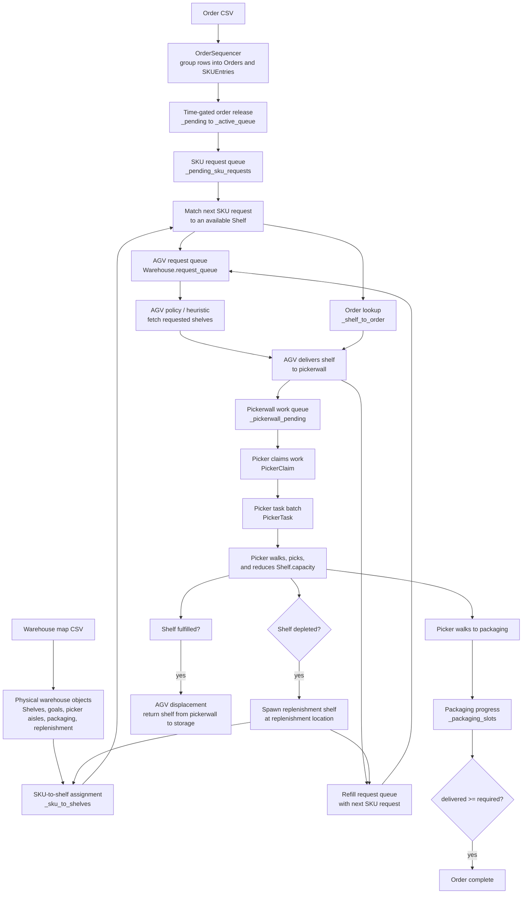

# Order Processing Flow Condensed

This condensed diagram shows the main handoffs in the current order-processing
pipeline: CSV rows become order/SKU queues, then physical shelf requests, then
pickerwall work, picker tasks, packaging progress, and replenishment.

## Reading Guide

The system digests orders in two conversions:

1. Abstract order demand becomes physical shelf movement:
   `Order -> SKUEntry -> Shelf -> AGV request`.
2. Delivered shelves become human/picker work:
   `Shelf at pickerwall -> PickerClaim -> PickerTask -> packaging progress`.

The highest-leverage queues to watch are:

- `_pending_sku_requests`
- `Warehouse.request_queue`
- `_pickerwall_pending`
- `_packaging_slots`
