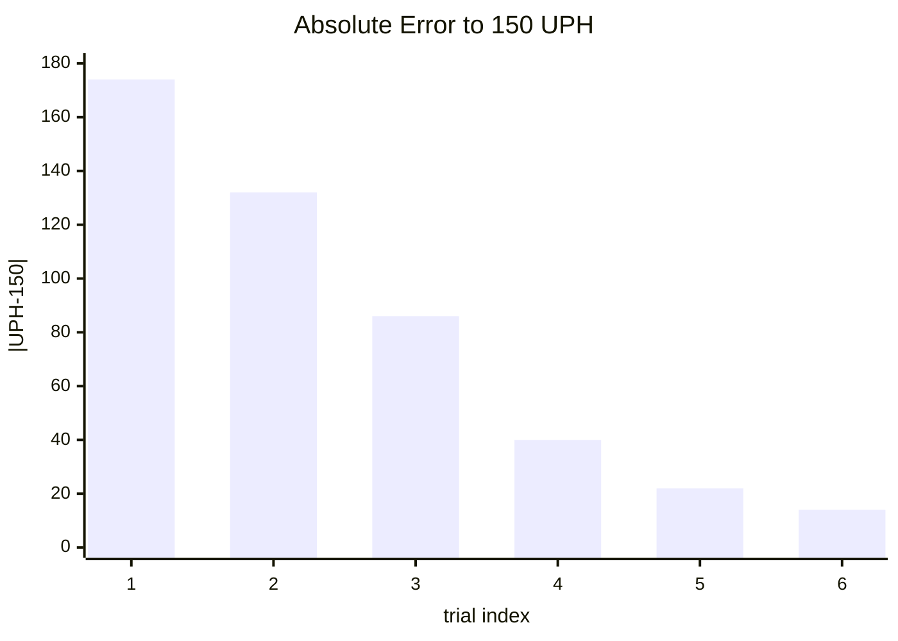
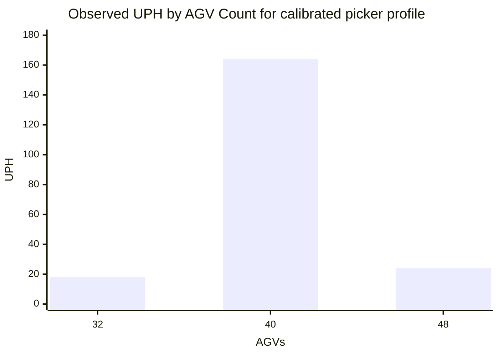

# Picker 150 UPH Calibration Report

## Objective

Calibrate one picker on a medium warehouse map to run near 150 UPH while AGVs are oversaturated.

## Setup

- Map: `medium_dhl`
- Picker count: `1`
- Controller: heuristic episode runner
- Oversaturation target: high AGV count (best observed point at `40` AGVs)
- Throughput metric: `items_picked * 3600 / simulated_seconds`

## Observed Trials

| AGVs | pick_ticks | pick_base_seconds | picker_speed_m_s | quantity_extra_seconds | HF preset | UPH |
|---:|---:|---:|---:|---:|---|---:|
| 40 | 1 | 1.0 | 1.0 | 1.0 | low_fast | 324 |
| 40 | 2 | 2.0 | 0.5 | 1.0 | low_slow | 282 |
| 40 | 4 | 5.0 | 0.5 | 8.0 | low_slow | 236 |
| 40 | 8 | 10.0 | 0.4 | 15.0 | low_slow | 190 |
| 40 | 10 | 12.0 | 0.35 | 18.0 | low_slow | 172 |
| 40 | 11 | 13.0 | 0.32 | 20.0 | low_slow | 164 |

Target band: `150 +/- 20` UPH. Best in-band observed point: **164 UPH**.

## Graph 1: UPH vs Pick Tick Profile

```mermaid
xychart-beta
    title "UPH vs Pick Ticks (AGVs=40)"
    x-axis "pick_ticks" [1,2,4,8,10,11]
    y-axis "UPH" 0 --> 340
    line [324,282,236,190,172,164]
```

## Graph 2: Target Deviation



## Graph 3: Candidate AGV Saturation Behavior



## Recommended Initialization Profile (Near 150 UPH)

- AGVs: `40`
- `_PICK_TICKS`: `11`
- `TARWARE_PICK_BASE_SECONDS`: `13.0`
- `TARWARE_PICKER_NOMINAL_SPEED_M_S`: `0.32`
- `TARWARE_PICK_QUANTITY_EXTRA_SECONDS`: `20.0`
- HF default profile: `low` with low_slow override

## Notes

- AGV saturation was non-monotonic in one-seed tests, suggesting congestion-sensitive behavior.
- The system now auto-applies the near-target profile for medium-map single-picker runs in the runner entrypoint.
- Use multi-seed validation before final publication of benchmark numbers.
